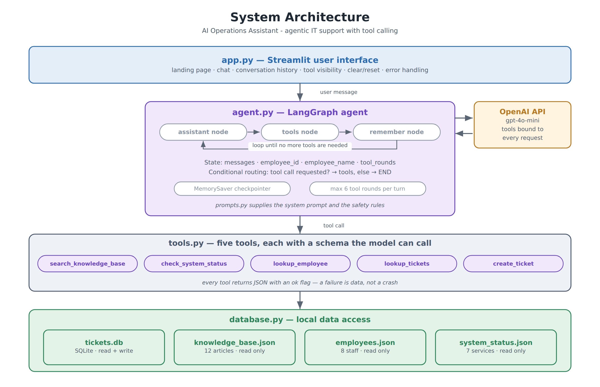
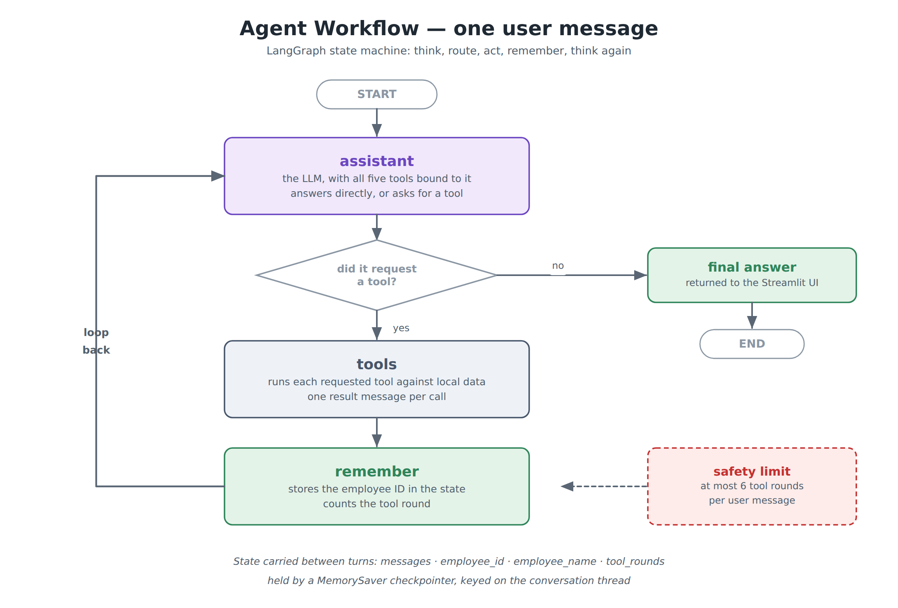

# AI Operations Assistant — IT Support Agent

An **agentic AI assistant** that helps employees with IT support requests. It understands what
the user is asking, decides for itself which of its five tools to use, runs them against local
company data, and answers from what it finds.

Built with **Python, LangGraph, OpenAI tool calling, SQLite and Streamlit**.
Start it with a single command: **`streamlit run app.py`**

*Final Project 2 — Certification Programme in Generative and Agentic AI Development*

---

## Table of contents

1. [Problem statement](#1-problem-statement)
2. [Solution overview](#2-solution-overview)
3. [Architecture diagram](#3-architecture-diagram)
4. [Technology stack](#4-technology-stack)
5. [Project structure](#5-project-structure)
6. [Setup instructions](#6-setup-instructions)
7. [Environment variables](#7-environment-variables)
8. [How to run the application](#8-how-to-run-the-application)
9. [Sample inputs](#9-sample-inputs)
10. [Sample outputs](#10-sample-outputs)
11. [Key design decisions](#11-key-design-decisions)
12. [Limitations](#12-limitations)

---

## 1. Problem statement

An IT service desk spends most of its time on a small number of repetitive requests: password
and VPN questions, "is the system down?", "what happened to the ticket I raised?", and "please
log this for me".

Each of those needs a different action against a different system — the knowledge base, the
status board, the ticket queue — and a human has to decide which one before they can start. A
simple chatbot cannot help, because answering these questions requires *doing something*, not
just generating text.

**The task:** build an assistant that can work out which action a request needs, take that
action against real local data, and reply with what it actually found — without inventing
ticket numbers, statuses or names when it does not know.

---

## 2. Solution overview

The assistant is an **agent**: the language model is given five tools and decides on its own
which to call, in what order, and with what arguments. It can chain several together to answer
one question, and it remembers what it has learned across the conversation.

| Tool | What it does | Data source |
|---|---|---|
| `search_knowledge_base` | Finds the relevant internal how-to article | `knowledge_base.json` |
| `check_system_status` | Reports whether a service is up, degraded or down | `system_status.json` |
| `lookup_employee` | Confirms who the user is from their employee ID | `employees.json` |
| `lookup_tickets` | Searches existing tickets by employee, ID, keyword or status | `tickets.db` (SQLite) |
| `create_ticket` | Validates and raises a new ticket, generating the ticket ID | `tickets.db` (SQLite) |

A typical multi-step turn looks like this:

```
User:  "What is the status of my laptop issue? My ID is EMP1024."

  agent  → lookup_employee(employee_id="EMP1024")
         ← Priya Raghunathan, Finance
  agent  → lookup_tickets(employee_id="EMP1024", keyword="laptop")
         ← TKT-1001, In Progress, End User Computing
  agent  → "Your laptop ticket TKT-1001 is In Progress with the End User
            Computing team. It was raised on 1 September."
```

The agent made two tool calls, in an order it chose, and answered from the results. Nothing in
that reply was invented.

---

## 3. Architecture diagram



Four layers, each in its own module, with a single direction of dependency: the UI calls the
agent, the agent calls the tools, the tools call the data layer. Nothing calls back upwards,
which is why every layer below the UI can be tested without Streamlit and without an API key.

### The agent workflow



This is the LangGraph state machine that runs for every user message. The `assistant` node
either answers or requests a tool; a **conditional edge** routes to the `tools` node or to the
end; after tools run, `remember` lifts durable facts into the state and the loop returns to
`assistant` so the model can use what it just learned.

---

## 4. Technology stack

| Layer | Technology | Why it was chosen |
|---|---|---|
| Language | **Python 3.10+** | Standard for AI work |
| UI | **Streamlit** | A chat interface, session state and conditional rendering in one file, with no front-end build step |
| Orchestration | **LangGraph** | Gives the agent an explicit state machine: named nodes, conditional routing, a tool-execution loop and a checkpointer for memory |
| Agent / LLM | **OpenAI `gpt-4o-mini`** via **LangChain** | `bind_tools` sends the tool schemas with every request; the model replies with a structured tool call rather than text to be parsed |
| Tool definition | **LangChain `@tool`** | Turns a typed Python function into a schema the model can call, with the docstring as the description the model reads |
| Ticket store | **SQLite** (`sqlite3`, standard library) | Tickets are written to and queried, and need generated IDs — a real table is the right fit |
| Reference data | **JSON** | The knowledge base, staff directory and status board are read-only, and stay readable for an examiner |
| Configuration | **python-dotenv** | Keeps the API key out of the source code |
| Testing | **pytest** | 33 tests that need no API key |
| CI | **GitHub Actions** | Runs those tests on every push |

---

## 5. Project structure

```
it-support-assistant/
│
├── app.py                    ← THE FILE YOU RUN — Streamlit UI and landing page
├── agent.py                  LangGraph agent: state, nodes, conditional routing
├── tools.py                  the five tools the agent can call
├── prompts.py                the system prompt and the safety rules
├── database.py               SQLite ticket store + JSON reference data
├── config.py                 all settings in one place
├── reset_database.py         utility: restore the ticket database to its seeded state
├── test_basic.py             33 automated tests (no API key needed)
│
├── data/
│   ├── knowledge_base.json       12 IT how-to articles
│   ├── employees.json            8 staff records
│   ├── system_status.json        7 monitored services
│   ├── tickets_seed.json         10 starting tickets
│   └── tickets.db                SQLite, created on first run (git-ignored)
│
├── docs/diagrams/            architecture and agent workflow images
├── .github/workflows/tests.yml
├── .env.example              template for the API key
├── .gitignore                excludes .env and the generated database
├── requirements.txt
├── README.md                 this file
├── HOW_TO_DEMO.md            a five-minute demonstration script
├── GIT_SETUP.md              step-by-step GitHub instructions
└── SKILLS_CHECKLIST.md       the twelve assessed skills mapped to the code
```

Every module opens with a comment block explaining its job, and every function has a docstring.

---

## 6. Setup instructions

**Prerequisites:** Python 3.10 or later, and an OpenAI API key.

```bash
# 1. Get the project
git clone https://github.com/<your-username>/it-support-assistant.git
cd it-support-assistant

# 2. (Recommended) create a virtual environment
python -m venv .venv
source .venv/bin/activate          # Windows:  .venv\Scripts\activate

# 3. Install the dependencies
pip install -r requirements.txt
```

**4. Add your API key.** Copy `.env.example`, rename the copy to `.env`, and put your real key
inside:

```
OPENAI_API_KEY=sk-your-real-key-here
```

The `.env` file must sit in the same folder as `app.py`. It is excluded by `.gitignore`, so it
can never be committed.

No database setup is needed. `data/tickets.db` is created and seeded from
`data/tickets_seed.json` the first time the application starts.

---

## 7. Environment variables

All configuration is read from `.env` by `config.py`. No other module reads the environment.

| Variable | Required | Default | Description |
|---|---|---|---|
| `OPENAI_API_KEY` | **Yes** | – | Your OpenAI API key. Without it the interface still loads and shows a warning, but the agent cannot answer. |
| `MODEL_NAME` | No | `gpt-4o-mini` | Any OpenAI model that supports tool calling. |

Settings that are not secrets live in `config.py`:

| Setting | Default | Description |
|---|---|---|
| `TEMPERATURE` | `0.1` | Low — the assistant should be consistent, not creative |
| `MAX_TOOL_ITERATIONS` | `6` | Safety cap on the tool loop per user message |
| `KB_SEARCH_RESULTS` | `3` | Articles returned by one knowledge search |
| `DUPLICATE_WINDOW_DAYS` | `14` | How far back the duplicate check looks |
| `TICKET_CATEGORIES` | 9 values | The closed list the agent must choose from |
| `TEAM_ROUTING` | category → team | Which team a new ticket goes to |

---

## 8. How to run the application

```bash
streamlit run app.py
```

Your browser opens at `http://localhost:8501` on the landing page.

> Running `python app.py` prints a reminder to use `streamlit run` instead — Streamlit
> applications need the Streamlit runtime.

**The interface provides:**

- a **landing page** describing what the assistant can do, with four example prompts you can
  click,
- a **chat interface** with full conversation history,
- a **"Tools used" panel** under every reply, showing each tool, its arguments and its result,
- a **sidebar** with the identified employee, tool-call count, tickets raised this session, the
  data source sizes and the conversation thread ID,
- a **Clear conversation** button that resets the chat *and* starts a new agent thread, and
- **error handling** — a failed API call shows a message in the chat rather than a stack trace.

**To reset the ticket data between demonstrations:**

```bash
python reset_database.py
```

**To run the tests** (no API key needed, under a second):

```bash
pytest -v
```

**Cost:** roughly $0.002 to $0.01 per conversation on `gpt-4o-mini`, depending on how many
tools the agent chooses to call.

---

## 9. Sample inputs

The four example prompts on the landing page each exercise a different path through the graph.

| Ask this | What the agent does |
|---|---|
| "How do I reset my VPN password?" | One tool: `search_knowledge_base` → answers from article KB-001 |
| "Is the VPN working today?" | One tool: `check_system_status` → reports the seeded VPN degradation |
| "What is the status of my laptop issue? My ID is EMP1024." | Two tools: `lookup_employee`, then `lookup_tickets` |
| "My VPN keeps dropping. Please raise a ticket. I'm EMP1067." | `create_ticket` — and if details are missing, it asks first |

Other things worth trying:

- **"Raise a ticket for me"** with no other detail — the agent asks for what it needs instead
  of guessing.
- **Ask for the same ticket twice** — the second attempt is blocked as a possible duplicate and
  the existing ticket is shown to you.
- **"My employee ID is EMP9999"** — an unknown ID is reported, not invented.
- **Follow-up questions** — once you have given your employee ID, the agent does not ask again.

**Sample employee IDs:** `EMP1024` (Priya, Finance), `EMP1067` (Thomas, Engineering),
`EMP1052` (Meera, Operations), `EMP1031` (Daniel, Sales).

All names, IDs and tickets in the data folder are **fictional**.

---

## 10. Sample outputs

### 10.1 A knowledge question

```
You:  How do I reset my VPN password?

Assistant:
  Your VPN password is separate from your Windows password and expires every
  90 days. To reset it:

  1. Open https://selfservice.nimbustech.local
  2. Sign in with your employee ID and complete the MFA prompt
  3. Choose "VPN credentials", then "Reset password"
  4. Set a password of at least 12 characters with a number and a symbol
  5. Wait two minutes, then reconnect the VPN client

  That is from the article "How to reset your VPN password" (KB-001). If the
  portal is unreachable, I can raise a ticket with the Network team for you.

  ▸ Tools used: Knowledge search
      search_knowledge_base  ·  OK
      Arguments: { "query": "how do I reset my VPN password" }
      Result: 3 article(s): KB-001 How to reset your VPN password, ...
```

### 10.2 A multi-step ticket lookup

```
You:  What is the status of my laptop issue? My ID is EMP1024.

Assistant:
  Thanks Priya. You have one laptop-related ticket:

  TKT-1001 — "Laptop very slow since the last Windows update"
  Status: In Progress, with the End User Computing team
  Raised 1 September, last updated 4 September.

  ▸ Tools used: Employee lookup, Ticket lookup
      lookup_employee  ·  OK   → Priya Raghunathan - Finance
      lookup_tickets   ·  OK   → 1 ticket(s): TKT-1001 (In Progress)
```

### 10.3 Ticket creation, with the duplicate check

```
You:  My VPN keeps dropping. Please raise a ticket. I'm EMP1067.

Assistant:
  I've raised that for you.

  Ticket TKT-1011 — "VPN disconnects every few minutes"
  Priority High, routed to the Network team.

  You may also want to know that the VPN Gateway is currently showing as
  Degraded, with the Network team already investigating.

  ▸ Tools used: Ticket creation
      create_ticket  ·  OK  → created TKT-1011 -> Network


You:  Actually raise another one for the same problem.

Assistant:
  You already have an open VPN ticket, TKT-1011, raised a moment ago. Rather
  than create a second one, would you like me to add your extra detail to it?
  If you would still prefer a separate ticket, tell me and I will raise one.

  ▸ Tools used: Ticket creation
      create_ticket  ·  FAILED
      Result: failed - A similar open ticket already exists for this
              employee, so no new ticket was created.
```

### 10.4 Missing information

```
You:  Raise a ticket for me.

Assistant:
  I can do that. I need a few details first:

  1. Your employee ID
  2. A one-line summary of the problem
  3. A short description of what is happening

  ▸ Tools used: Ticket creation
      create_ticket  ·  FAILED
      Result: failed - Cannot create a ticket: missing required
              information: subject, description.
```

> The wording of the replies is generated by the model and varies slightly between runs. The
> tool calls, arguments and results shown in the panels are exactly what the system produces.

---

## 11. Key design decisions

**1. The model chooses the tools; the code does not.**
There is no intent classifier and no keyword routing table. The five tools are bound to the
model with `bind_tools`, so their schemas travel with every request and the model returns a
structured call. This is what makes it an agent rather than a workflow with an LLM in it.

```python
llm = ChatOpenAI(model=..., temperature=0.1).bind_tools(ALL_TOOLS)
```

**2. The tool docstrings are prompts.**
`@tool` uses each function's docstring as the description the model reads when deciding what to
call. They are written for the model — including when *not* to use a tool — which is why
`search_knowledge_base` says "Do NOT use this to look up a specific person's tickets".

**3. Conditional routing plus a loop, not a straight line.**
`route_after_assistant` inspects the model's reply: if it contains tool calls, the graph goes to
the `tools` node; otherwise the turn ends. After tools run, control returns to the assistant, so
the agent can chain calls — look up the employee, *then* look up their tickets — within a single
user message.

**4. Memory is structured, not just chat history.**
The `remember` node lifts the employee ID and name out of a successful `lookup_employee` result
into named state fields. Those are injected into the next system prompt as KNOWN CONTEXT, so the
assistant never asks for the ID twice. A `MemorySaver` checkpointer keyed on a thread ID keeps
that state across Streamlit reruns.

**5. Tools never raise; they return failures as data.**
Every tool returns a JSON string with an `ok` flag. A missing employee, a broken data file or a
validation failure comes back as `ok: false` with an explanation, which the agent can read and
relay. The application cannot crash because a tool did not like its arguments.

**6. Safety is enforced in code, not only in the prompt.**
The prompt tells the model not to invent things; the tools make it impossible.

| Rule | Where it is enforced |
|---|---|
| A ticket needs an employee ID, category, subject and description | `create_ticket` returns `missing_fields` and writes nothing |
| The category must be one of nine values | `create_ticket` rejects anything else |
| The employee must exist | Checked against the directory before any write |
| No duplicate tickets | `find_possible_duplicates` blocks a second open ticket in the same category within 14 days, unless the user explicitly confirms |
| Ticket IDs are never invented | Generated by `database.next_ticket_id()`, never by the model |
| The agent cannot loop forever | `MAX_TOOL_ITERATIONS` caps the tool rounds per message |

**7. The right storage for each kind of data.**
Tickets go in SQLite because they are written, queried and need generated IDs. The knowledge
base, staff directory and status board are read-only reference data and stay as JSON, so they
can be opened and read during a demonstration.

**8. The user can see what the agent did.**
Every reply carries a "Tools used" panel with the tool name, the exact arguments the model
chose, and the result. An agent that acts on your behalf should not be a black box.

---

## 12. Limitations

- **Knowledge search is keyword-based, not semantic.** A question phrased with entirely
  different words from the article will not match. Embeddings and a vector store would fix
  this; the current approach was chosen because it is deterministic and needs no network call.
- **There is no authentication.** The assistant trusts whatever employee ID it is given. A real
  deployment would take the identity from the signed-in session, not from the chat.
- **Tickets can be created but not updated or closed.** Those tools were out of scope.
- **Memory lasts as long as the process.** `MemorySaver` keeps state in memory, so restarting
  Streamlit loses the conversation. A `SqliteSaver` checkpointer would make it durable.
- **One conversation at a time.** The app is designed for a single user on a local machine.
  Concurrent users would need a per-user thread ID and a shared database with proper locking.
- **The agent cannot actually fix anything.** It searches, looks up and raises tickets. It
  cannot reset a password or grant access, and the prompt makes it say so.
- **English only**, and the sample data is a single fictional organisation.

---

## Further reading in this repository

| Document | Purpose |
|---|---|
| [`SKILLS_CHECKLIST.md`](SKILLS_CHECKLIST.md) | The twelve assessed skills mapped to the exact file and function |
| [`HOW_TO_DEMO.md`](HOW_TO_DEMO.md) | A five-minute walkthrough for demonstrating the project |
| [`GIT_SETUP.md`](GIT_SETUP.md) | Step-by-step commands for putting the project on GitHub |
